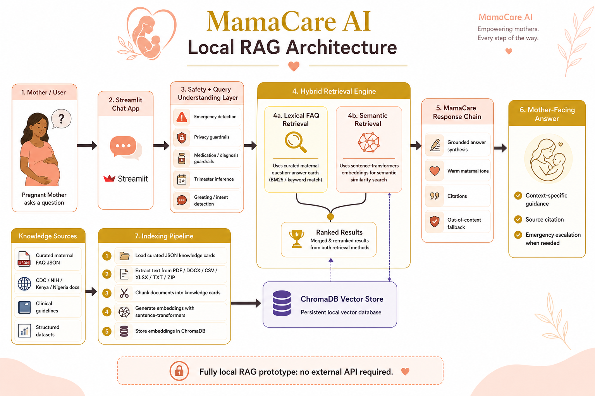

# MamaCare AI

MamaCare AI is a maternal health support prototype designed to help pregnant mothers navigate pregnancy with warm, grounded, and stage-aware guidance.

The current build focuses on a safe local RAG workflow:

- a Streamlit chat experience for mothers
- a curated maternal knowledge base
- local retrieval using `sentence-transformers` embeddings and ChromaDB
- lexical FAQ matching for high-priority mother questions
- deterministic safety guardrails for emergencies, medication, privacy, and out-of-scope requests

This project was built from the product direction captured in `MamaCare_AI_Project_Plan.docx`, then narrowed into a practical prototype that can be demonstrated, reviewed, and improved collaboratively.

## Architecture



## Why This Project Exists

Pregnant mothers often need quick, clear, and reassuring answers about symptoms, nutrition, fetal movement, antenatal care, birth preparation, and warning signs. MamaCare AI is being developed as a digital maternal support companion that can:

- answer common pregnancy questions in plain language
- surface warning signs that need medical review
- stay grounded in trusted knowledge instead of guessing
- provide a user experience that feels supportive rather than clinical

## What The Prototype Does Today

- supports pregnancy questions across trimester-specific topics
- uses curated FAQ cards as the highest-trust answer layer
- uses hybrid retrieval to improve matching of natural phrasing
- returns citations for grounded responses
- blocks unsafe medication-style answers and diagnostic claims
- escalates emergency symptom patterns immediately
- supports local operation without an external API

## What It Does Not Do

- it is not a diagnostic tool
- it does not prescribe medication doses
- it does not replace a qualified healthcare professional
- it does not use real patient data
- it should not be used in production until its knowledge base is enriched with approved and maintained clinical content

## How The Project Was Built

MamaCare AI was built in layers so the team could improve accuracy and safety step by step:

1. A curated maternal knowledge layer was created first using structured `KnowledgeCard` JSON files.
2. A local lexical retriever was added to reliably answer common pregnancy questions.
3. A persistent local RAG pipeline was introduced using ChromaDB and `sentence-transformers`.
4. Safety guardrails were added outside the retrieval system for emergency detection, privacy protection, and medication blocking.
5. A Streamlit interface was designed to make the experience warm, simple, and mother-friendly.

This structure makes the prototype easier to review, extend, and harden for wider deployment.

## Core Models And Retrieval Approach

MamaCare is currently a local hybrid retrieval system, not a fine-tuned medical LLM.

### Active retrieval stack

- Embedding model: `sentence-transformers/all-MiniLM-L6-v2`
- Vector database: `ChromaDB`
- Lexical fallback: local curated FAQ matcher
- Response layer: rule-based grounded response chain

### Why this matters

- semantic retrieval helps with natural phrasing and paraphrased questions
- lexical FAQ matching protects critical maternal questions from being missed
- curated cards prevent the assistant from answering mothers with raw report fragments
- local storage keeps the prototype usable without an external API

## Technology Stack

- Python
- Streamlit
- ChromaDB
- `sentence-transformers`
- Pandas
- PyPDF
- Python-Docx
- OpenPyXL
- XLRD

## How It Works

When a mother asks a question:

1. the app receives the message in Streamlit
2. guardrails check for emergency, privacy, medication, and out-of-scope patterns
3. trimester hints are inferred from the question when possible
4. a fast curated FAQ search runs first
5. if the fast path is weak, semantic retrieval runs against the local ChromaDB index
6. the system prioritizes trusted maternal guidance cards over raw reports or tables
7. the response layer formats a warm, grounded answer with escalation and citations

## Repository Structure

```text
app.py
data/
  external/
  index/
    chroma_db/
  knowledge/
  sample_health_records/
  seed/
docs/
  assets/
  curated_kb_format.md
  local_rag_pipeline.md
  mvp_scope_review.md
  vector_db_workflow.md
scripts/
  build_vector_db.py
  generate_sample_health_records.py
  query_vector_db.py
  smoke_test.py
src/
  mamacare_ai/
requirements.txt
CONTRIBUTING.md
```

## Quick Start

### 1. Create and activate a virtual environment

```bash
python -m venv venv
```

Windows PowerShell:

```bash
.\venv\Scripts\Activate.ps1
```

### 2. Install dependencies

```bash
python -m pip install -r requirements.txt
```

Use the same Python interpreter for install, indexing, smoke tests, and Streamlit. On machines with multiple Python installations, mixing interpreters can make ChromaDB or `sentence-transformers` appear missing even when they are installed elsewhere.

### 3. Build the local RAG index

```bash
python scripts/build_vector_db.py
```

### 4. Run a retrieval check

```bash
python scripts/query_vector_db.py "How can I ensure I am eating healthy?"
```

### 5. Run the smoke test

```bash
python scripts/smoke_test.py
```

### 6. Start the app

```bash
python -m streamlit run app.py
```

## Knowledge Sources

The prototype can ingest:

- curated maternal FAQ JSON cards
- maternal guidance JSON cards
- PDF documents
- DOCX documents
- CSV files
- XLSX and XLS files
- TXT and MD files
- ZIP archives containing supported files

### Important note on PDFs

Some PDFs contain little or no extractable text. For those files, add a same-name `.txt` or `.md` sidecar file after OCR or text export.

Example:

- `ACOG During Pregnancy hub.pdf`
- `ACOG During Pregnancy hub.txt`

The indexer will automatically use the sidecar text during knowledge build.

## Guardrails And Accuracy Approach

MamaCare is designed to reduce hallucination by:

- answering directly only from trusted maternal guidance cards
- down-ranking raw surveys, tables, and report fragments
- separating retrieval from safety logic
- escalating emergencies outside the normal answer flow
- using uncertainty fallbacks when trusted grounded context is weak

This is especially important for maternal health, where a warm answer must still remain safe and evidence-grounded.

## Knowledge Enrichment Areas

The current build is strong as a prototype, but the knowledge base still needs to grow in a more systematic way before wider deployment.

High-priority enrichment areas:

- official antenatal, nutrition, and postpartum guidance from WHO, CDC, and local ministries of health
- more curated cards for medicine safety, vaccines, breastfeeding, mental health, and newborn care
- multilingual support content, especially English plus Swahili and other local languages
- clearer localized care advice for Kenya, Nigeria, and other target settings
- OCR and text-cleaning workflows for scanned PDFs
- better source tagging by topic, trimester, urgency, and audience

Recommended next phase for knowledge growth:

1. add more mother-style paraphrases for must-answer questions
2. convert non-searchable PDFs into text sidecars
3. expand curated FAQ coverage with reviewed maternal guidance
4. create evaluation sets for symptom, nutrition, labour, postpartum, and emergency questions
5. add source freshness and review workflows for ongoing maintenance

For more detail, see [docs/vector_db_workflow.md](docs/vector_db_workflow.md) and [docs/local_rag_pipeline.md](docs/local_rag_pipeline.md).

## Future Build For Scale

To reach a wider audience at scale, the following areas should be prioritized:

- API layer for mobile, WhatsApp, web, and health-worker integration
- multilingual retrieval and response support
- stronger semantic reranking
- local or hosted answer-synthesis model on top of the RAG layer
- evaluation dashboard for answer quality and safety
- clinician review workflow for knowledge updates
- analytics and monitoring for high-risk question patterns
- offline-first or low-bandwidth deployment options
- regional source packs for multiple countries

## Recommended GitHub Publishing Additions

Before public release, it would also be helpful to add:

- a project license
- issue templates
- pull request templates
- sample screenshots of the Streamlit interface
- benchmark results for must-answer maternal questions

## Contributing

See [CONTRIBUTING.md](CONTRIBUTING.md) for guidance on extending the knowledge base, adding new source material, and testing retrieval safely.
